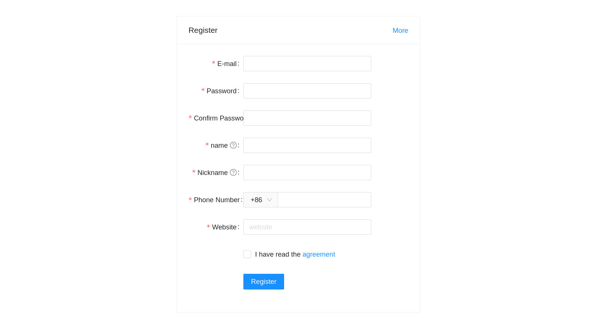

# Reactive Job Demo App

Example of how to use reactive API by implementing job management application 

## 1. Stack

* Kotlin (Java `17`)
* Spring Boot (Webflux, Security)
* Reactive `MongoDB` (docker-compose)
* Angular (primitive login page and job list example)

## 2. Project Structure

The project consists in two modules:

* `backend`  (Spring app)
* `frontend` (Angular app)

# 🌞 Build and run project

## For local dev without docker

1. Setup mongodb on you local machine with default configuration

2. Run `frontend` application:

```shell
cd frontend
npm install --global yarn
yarn install
yarn start
```
3. Run `backend` application:
```shell
cd backend
./gradlew bootRun
```

## For local dev with docker ( strongly recommend )

Run the next command under the project root.

```shell
make up
```

This will do the all jobs that are necessary to run the application.

In order to escape the console, press Ctrl+C key together.


## Try it

For front page 
[http://localhost:4200](http://localhost:4200)

Login Info

#### `user@example.com` : `userPassword`

To obtain JWT for the protected API, there are 2 ways

1. curl command
 
```shell
curl -i -X POST http://localhost:8090/api/v1/users/login -H 'Content-Type: application/json' -d '{"username":"user@example.com","password":"userPassword"}'
```

2. Chrome Developer Tab
 
if you look at network section, you can find the header information containing Authorization header.


For back end API documentation
[http://localhost:8090/swagger-ui.html](http://localhost:8090/swagger-ui.html)

### Trouble shooting

You need to first look at the angular proxy configuration file, if there is an issue on the rest api communication.
Under the fronend forlder, you can find `proxy.conf.js` file.
Please look at carefully the next line

```json
const proxyConfig = [
  {
    context: '/api',
    // pathRewrite: { '^/api': '' },
here -> target: 'http://192.168.1.192:8090',  // for Dev
here -> // target: 'http://localhost:8090',  // for Local Dev
here -> // target: 'http://app:8090',  // in case of docker
    headers: {
      // Website you wish to allow to connect
      'Access-Control-Allow-Origin': '*',

      // Request methods you wish to allow
      'Access-Control-Allow-Methods': 'GET, POST, OPTIONS, PUT, PATCH, DELETE',

      // Request headers you wish to allow
      'Access-Control-Allow-Headers': 'X-Requested-With,content-type',

      // Set to true if you need the website to include cookies in the requests sent
      // to the API (e.g. in case you use sessions)
      'Access-Control-Allow-Credentials': true,

      "Connection": "keep-alive"
    },
    changeOrigin: true,
    logLevel: "debug",
    secure: false
  }
];
```
and uncomment the target api url according to your setup environment.

## Screen Shot

1. Login
   
2. Signup
   
3. Job List
    
4. New Job
   
5. Edit Job
   
6. Delete Job
   
